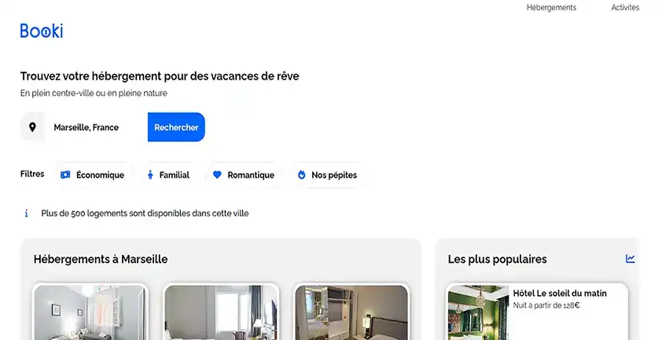

  

 

    
  

  
  

   ## Descrition du projet :
  

  Dans ce projet, j'ai dû créer la page d’accueil d’une agence de voyage en utilisant HTML5 et CSS3.
L’objectif principal était d’intégrer une interface responsive basée sur des maquettes Figma pour mobile, tablette et desktop.

